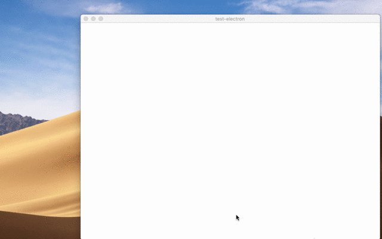

# 原生文件拖 & 放

## 概览

作为桌面程序，当然希望能够实现操作系统的 drag & drop 功能。 很多网站已经支持拖拽文件， Electron 当然也支持要在您的应用中实现此功能，您需要调用 (`webContent.startDrag(item)` API)[https://www.electronjs.org/zh/docs/latest/api/web-contents#contentsstartdragitem] 响应 `ondragstart` 事件。

## 示例

一个演示如何动态创建要从窗口中拖出的文件的示例。

<br>

查看 `apps/00002/00011/`

```
npm start -- -p apps/00002/00011/main.js
```

<br>

