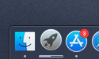
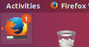

# Taskbar Progress Bar (Windows & macOS)

## 概览

进度条使窗口能够向用户提供其进度信息，而无需被切换到前台。在Windows环境下，进度条被显示在任务栏按钮上。

<br>


<br>

在MacOS环境下，进度条将被显示在dock栏图标上

<br>



<br>

在Linux系统中，Unity桌面也有相似的特性，能在Launcher上显示进度条。

<br>



<br>

> 注意：在 Windows 上，每个窗口都可以有自己的进度条，而在 macOS 和 Linux（unity桌面）上，同一个应用程序只能有一个进度条。

<br>

这三种环境中的进度条功能由同一个API实现：`BrowserWindow` 实例下的 (`setProgressBar()`)[https://www.electronjs.org/zh/docs/latest/api/browser-window#winsetprogressbarprogress-options] 方法。 此方法以介于 `0` 和 `1` 之间的小数表示进度。 例如，如果有一个耗时很长的任务，它当前的进度是63%，那么你可以用 `setProgressBar(0.63)` 来显示这一进度。

<br>

将参数设置为负值 (例如， `-1`) 将删除progress bar。 设定值大于 `1` 在 Windows 中将表示一个不确定的进度条 ，或在其他操作系统中显示为 100%。 一个不确定的progress bar 仍然处于活动状态，但不显示实际百分比， 并且用于当 您不知道一个操作需要多长时间才能完成的情况。

<br>

参见 (API documentation for more options and modes)[https://www.electronjs.org/zh/docs/latest/api/browser-window#winsetprogressbarprogress-options]。

## 示例

<br>

查看 `apps/00002/00015/`

```
npm start -- -p apps/00002/00015/main.js
```

<br>

启动 Electron 应用程序后，Dock (macOS) 或 taskbar (Windows, Unity) 应该显示一个进度条, 从零开始, 到100%到完成。 应该显示不确定的 (Windows) 或短暂的固定到100% (其他操作系统) 并然后循环。