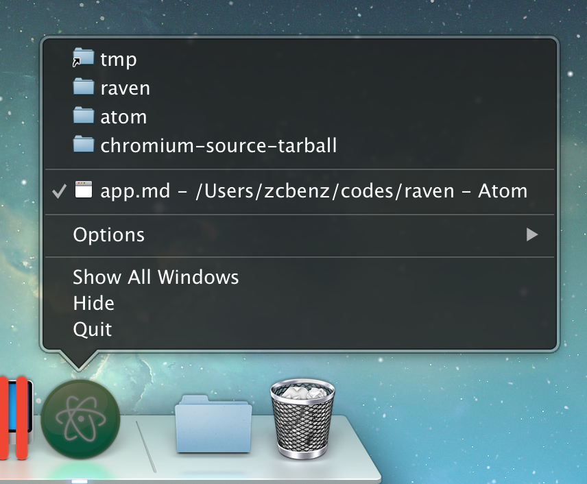

# 最近文档 (Windows & macOS)

## 概览

Windows 和 macOS 分别通过打开跳转列表和dock菜单使应用程序能够快速的访问最近打开的文档列表。

**JumpList:**

<br>


<br>

**应用 dock 菜单**

<br>



<br>

## 示例

#### 管理最近的文档

<br>

查看 `apps/00002/00016/`

```
npm start -- -p apps/00002/00016/main.js
```

<br>

###### 添加最近的文档

若要增加一个文件到最近文件列表，你可以使用(app.addRecentDocument)[https://www.electronjs.org/zh/docs/latest/api/app#appaddrecentdocumentpath-macos-windows] API.

<br>

启动 Electron 应用程序后，右键点击应用程序图标。 在本指南中，本项是位于项目根目录下的 Markdown 文件： 您应该可以看到添加到最近文件列表中的 `recently-used.md `：

<br>


<br>

###### 清除最近文档列表

若要清空最近文件列表，你可以使用 (app.clearRecentDocuments)[https://www.electronjs.org/zh/docs/latest/api/app#appclearrecentdocuments-macos-windows] API. 在此指南中，一旦所有窗口都关闭，文件列表就会被清除。

## 附加信息

#### Windows 注意事项

若要在 Windows 上使用此功能，您的应用程序必须注册为这类文件的处理程序。 否则，文件将不会在跳转列表中出现。 你可以在 (Application Registration)[https://msdn.microsoft.com/en-us/library/cc144104(VS.85).aspx] 里找到所有关于注册事宜的说明。

<br>

当用户点击“跳转列表”上的一个文件时，系统会启动一个新的应用程序的实例 ，而文件的路径将作为一个命令行参数被传入这个实例。

#### macOS 注意事项

**将"最近文档列表"添加到应用程序菜单**

<br>

您可以添加菜单项以访问和清除最近的文档，方法是在菜单模板中添加以下代码片段：

<br>

```
{
  "submenu":[
    {
      "label":"Open Recent",
      "role":"recentdocuments",
      "submenu":[
        {
          "label":"Clear Recent",
          "role":"clearrecentdocuments"
        }
      ]
    }
  ]
}
```

<br>

请确保在 `'ready'`事件后添加应用菜单而不是之前，否则菜单项将被禁用：

<br>

```
const { app, Menu } = require('electron')

const template = [
  // 这里是菜单模版
]
const menu = Menu.buildFromTemplate(template)

app.whenReady().then(() => {
  Menu.setApplicationMenu(menu)
})
```

<br>


<br>

从 "最近文档" 菜单中请求文件时, 将为其发出 `app` 模块的 `open-file` 事件。