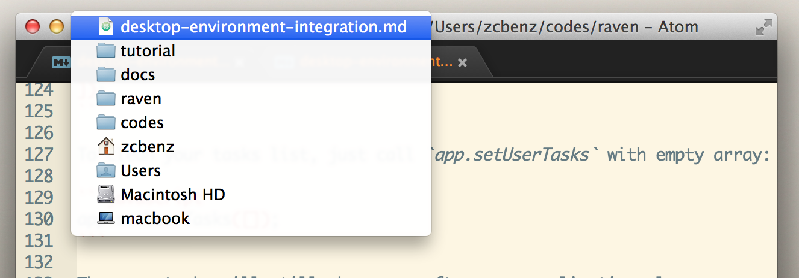

# Representing Files in a BrowserWindow (macOS)

## 概览

在 macOS 上，您可以为应用程序中的任何窗口设置一个代表文件。 代表文件的图标将显示在标题栏中，当用户 `Command-单击` 或 `Control-单击`，一个带有文件路径的弹出窗口将会显示。

<br>



<br>

> 注意：上面的屏幕截图是一个示例，其中此功能用于指示 Atom 文本编辑器中当前打开的文件。

<br>

您还可以设置窗口的编辑状态，以便文件图标可以指示该窗口中的文档是否已修改。

<br>

要设置窗口的代表文件，您可以使用 (BrowserWindow.setRepresentedFilename)[https://www.electronjs.org/zh/docs/latest/api/browser-window#winsetrepresentedfilenamefilename-macos] 和 (BrowserWindow.setDocumentEdited API)[https://www.electronjs.org/zh/docs/latest/api/browser-window#winsetdocumenteditededited-macos]。

## 示例

<br>

查看 `apps/00002/00017/`

```
npm start -- -p apps/00002/00017/main.js
```

<br>

启动 Electron 应用程序后，在按下 `Command` 或 `Control` 键时单击标题。您应该会在顶部看到一个带有代表文件的弹出窗口。在本指南中，这是当前用户的主目录：

<br>


<br>
