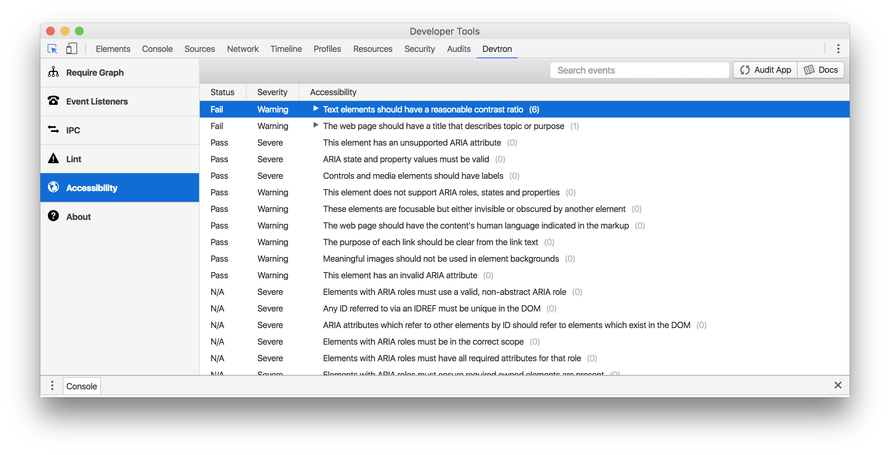

# 辅助功能

为程序制作辅助功能是很重要的。在这里，我们很高兴地向你们介绍 (Devtron)[https://electronjs.org/devtron] 和 (Spectron)[https://electronjs.org/spectron]。这两个新功能有机会使开发者们让他们的应用程序更加可用。

<br>

Electron 应用中有关辅助功能的开发和网站是相似的，因为两者最终使用的都是HTML. 然而, 对于Electron应用, 你不能使用在线的辅助功能审查者, 因为你的应用没有一个URL可以提供给审查者.

<br>

这些功能将会提供一些审查工具给你的Electron 应用。 您可以选择使用 Spectron 将审查添加到你的测试环境中，或在开发者工具（DevTools）中使用Devtron。 详见各工具的文档.

## Spectron

在测试框架Spectron中，你可以审查应用程序中的每个 window 和 `<webview>` 标签。 例如：

<br>

```
app.client.auditAccessibility().then(function (audit) {
  if (audit.failed) {
    console.error(audit.message)
  }
})
```

<br>

你可以从这里 (Spectron文档)[https://github.com/electron/spectron#accessibility-testing] 阅读到更多有关于这个功能的信息。

## Devtron

在 Devtron，有一个辅助选项卡，允许你在应用中审核一个页面，并排序和过滤结果。

<br>



<br>

这两种工具都使用了Google 为 Chrome 所构建的 (辅助功能开发工具)[https://github.com/GoogleChrome/accessibility-developer-tools] 库。 您可以在 (repository's wiki)[https://github.com/GoogleChrome/accessibility-developer-tools/wiki/Audit-Rules] 上了解到更加详细的辅助功能审核规则。

<br>

如果你知道其他适用于Electron的辅助功能开发工具, 请通过pull request添加到本文档中.

## 手动启用辅助功能

当辅助技术存在时，Electron 应用程序将自动启用辅助功能（例如 Windows 上的 (JAWS)[https://www.freedomscientific.com/products/software/jaws/] 或 macOS 上的 (VoiceOver)[https://help.apple.com/voiceover/mac/10.15/]）。 有关详细信息, 请参阅 Chrome 的 (辅助功能文档)[https://www.chromium.org/developers/design-documents/accessibility#TOC-How-Chrome-detects-the-presence-of-Assistive-Technology] 。

<br>

还可以在 Electron 应用程序或在第三方本地软件中设置标志来手动切换这些功能。

#### 使用 Electron 的 API​

通过使用 (`app.setAccessibilitySupportEnabled(enabled) API`)[https://www.electronjs.org/zh/docs/latest/api/app#appsetaccessibilitysupportenabledenabled-macos-windows]，您可以在应用程序首选项中的手动向用户暴露Chrome的访问树。 请注意，用户的系统辅助工具优先于此设置并将覆盖它。

#### 在第三方软件内

###### macOS

在 macOS 的 Electron 应用中，可以通过 `AXManualAccessibility` 来切换第三方的辅助功能：

<br>

```
CFStringRef kAXManualAccessibility = CFSTR("AXManualAccessibility");

+ (void)enableAccessibility:(BOOL)enable inElectronApplication:(NSRunningApplication *)app
{
    AXUIElementRef appRef = AXUIElementCreateApplication(app.processIdentifier);
    if (appRef == nil)
        return;

    CFBooleanRef value = enable ? kCFBooleanTrue : kCFBooleanFalse;
    AXUIElementSetAttributeValue(appRef, kAXManualAccessibility, value);
    CFRelease(appRef);
}
```